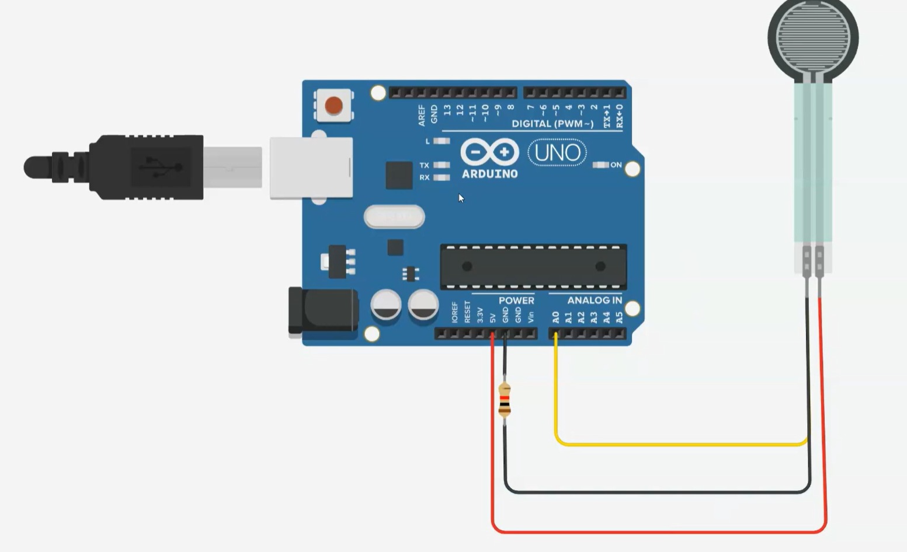
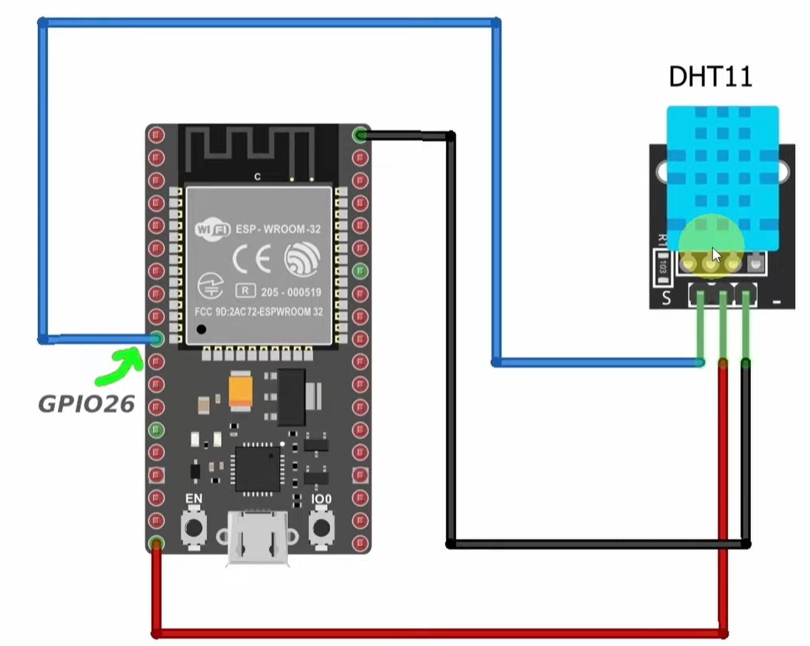
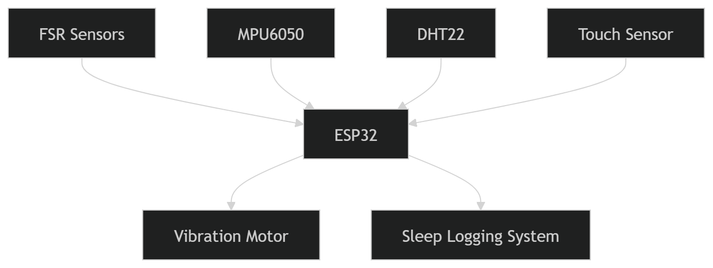

# : Smart Sleep Monitor

## Description

This project implements a smart sleep monitoring system designed to enhance sleep quality through real-time monitoring and feedback. Utilizing FSR sensors for pressure detection and temperature sensors, the system provides intelligent alerts and sleep quality assessments.

## Features

- **Pressure Detection**: FSR sensors detect body pressure on the mattress, activating the system from hibernate mode to conserve power.
- **Power Efficiency**: Enters hibernate mode when no pressure is detected, minimizing energy consumption.
- **Vibration Alerts**: Triggers gradual vibration feedback if sleep conditions are suboptimal (e.g., high movement or temperature changes lasting over a minute).
- **Sleep Quality Monitoring**: Assesses sleep quality based on movement patterns and temperature readings.
- **User Interaction**: Allows users to snooze vibration for 10 seconds with a single click or dismiss it entirely with a double click.
- **Data Logging**: Logs sleep data when active, providing insights into sleep patterns.
- **Fallback Handling**: Includes robust handling for sensor availability.

## Hardware Components

- FSR Sensors (Force Sensitive Resistors)
- Temperature Sensor
- Touch Sensor / Button for user input
- Vibration Motor for haptic feedback
- D35 Development Kit for processing and control

## Connection Details

- **FSR Sensor**

  - One lead to 5V or 3.3V depending on the board and sensor design.
  - Other lead through a pull-down resistor to GND.
  - Sense line to an analog input pin on the ESP32 / D35 board.

- **Temperature Sensor (DHT11 / similar)**

  - VCC to 3.3V.
  - GND to GND.
  - Data pin to GPIO26 on the ESP32 / D35 board (as shown in the wiring diagram).

- **Touch Sensor / Button**
  - Connect the sensor or button signal pin to the designated GPIO input pin on the D35 board.
  - Use a pull-down resistor or configure the input pin with internal pull-down if available.
  - Ensure the sensor share a common ground with the D35 board.
  - Single press activates snooze; double press dismisses vibration alerts.

- **Vibration Motor**
  - Powered from the board's output pin with a suitable transistor or driver.
  - GND to common ground.
  - Control signal to the assigned GPIO pin for haptic feedback.

- Use common ground for all sensors and actuators to ensure reliable signal reference.

## System Flow

The system operates as follows:
1. In hibernate mode when no pressure is detected.
2. Activates upon pressure detection, converting pressure to voltage readings.
3. Monitors for high changes in values (indicating restlessness) or stable values (good sleep).
4. Triggers vibration if poor conditions persist.
5. Provides options for user to interact with alerts.
6. Logs sleep quality metrics based on movement and temperature.

## Diagrams

### Main System Diagram

### Alternative System Diagram
.png)

## Usage Instructions

1. Install the sensors on the mattress as per the hardware setup guide.
2. Power on the D35 devkit.
3. The system will automatically enter monitoring mode when pressure is detected.
4. If vibration alerts occur, use the button to snooze (single press) or dismiss (double press).
5. Review logged data for sleep quality insights.

## Requirements

- D35 Development Kit
- FSR Sensors
- Temperature Sensor
- Vibration Motor
- Power Supply

## Installation

1. Clone this repository.
2. Set up the hardware connections as described in the hardware documentation.
3. Upload the firmware to the D35 kit.
4. Test the sensor readings and vibration functionality.

## Contributing

Contributions are welcome. Please fork the repository and submit a pull request.

## License

This project is licensed under the MIT License.
